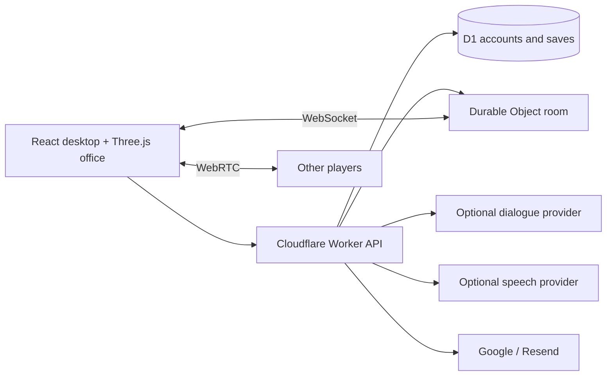

<div align="center">

# Scam With Your Friends — Web

### Juego de fiesta cooperativo en línea de centro de llamadas · simulador de trabajo · comedia negra, en tu navegador

**Contesta llamantes de IA ficticios, habla por voz con tu equipo, gestiona tu tiempo, cumple la cuota diaria y sobrevive a la evaluación de desempeño.**

[English](README.md) · [简体中文](README.zh-CN.md) · [Português](README.pt-BR.md) · **Español** · [日本語](README.ja.md) · [Comentarios](https://github.com/mrzh7/scam-with-your-friends-web/issues/new/choose)

<p align="center">
  <a href="https://scam.gamefun.world"><strong>▶ Jugar a la demo</strong></a>
  &nbsp;·&nbsp;
  <a href="#mira-el-tráiler"><strong>Tráiler</strong></a>
  &nbsp;·&nbsp;
  <a href="#cómo-jugar"><strong>Jugabilidad</strong></a>
  &nbsp;·&nbsp;
  <a href="docs/DEPLOYMENT.md"><strong>Despliegue</strong></a>
  &nbsp;·&nbsp;
  <a href="docs/QUICKSTART.md"><strong>Documentación</strong></a>
</p>

<p align="center">
  <a href="LICENSE"></a>
  <a href="https://scam.gamefun.world"></a>
  
  
  
  <a href=".github/workflows/ci.yml"></a>
  <a href="https://x.com/mr_zh7"></a>
</p>

<!-- Ranking badges (uncomment when live — do not leave broken images):
  Trendshift appears only after the repo is listed at https://trendshift.io
  (replace REPO_ID with the id shown on https://trendshift.io/repositories/<id>):
  <a href="https://trendshift.io/repositories/REPO_ID" target="_blank"></a>
  Star History rank badge (works only once the repo is in their ranking):
  <a href="https://www.star-history.com/mrzh7/scam-with-your-friends-web"></a>
-->

[](docs/media/trailer-preview.gif)

</div>

## Inspirado en el juego oficial

**Tienda oficial:** [Scam With Your Friends en Steam](https://store.steampowered.com/app/4954910/Scam_With_Your_Friends/)

> Dirige un centro de llamadas de estafas con tus amigos. Usa esquemas cada vez más ridículos para engañar a llamantes de IA y quitarles los ahorros de toda su vida. Cumple la cuota diaria, siembra el caos en la oficina y sobrevive a una evaluación de desempeño brutal de tu jefe irascible.
>
> *(Traducción de la descripción corta de la página de Steam en inglés; el texto oficial en inglés está en el README en inglés.)*

<p align="center">
  <a href="https://store.steampowered.com/app/4954910/Scam_With_Your_Friends/"></a>
</p>

<p align="center">
  <a href="https://store.steampowered.com/app/4954910/Scam_With_Your_Friends/"></a>
  <a href="https://store.steampowered.com/app/4954910/Scam_With_Your_Friends/"></a>
</p>
<p align="center">
  <a href="https://store.steampowered.com/app/4954910/Scam_With_Your_Friends/"></a>
  <a href="https://store.steampowered.com/app/4954910/Scam_With_Your_Friends/"></a>
</p>

Este repositorio es un **experimento gratuito y no oficial en el navegador**. **No** es el juego original, **no** es un port oficial y **no está afiliado** con los desarrolladores originales. El encabezado y las capturas de Steam de arriba son © de sus titulares y se muestran **por hotlink desde Steam solo como referencia** — no están incluidos en este repositorio. Ver [THIRD_PARTY_NOTICES.md](THIRD_PARTY_NOTICES.md).

**Scam With Your Friends — Web** es un remake no oficial y gratuito que puedes jugar en el navegador en [scam.gamefun.world](https://scam.gamefun.world): dirige un **centro de llamadas de estafas con tus amigos**, usa esquemas cada vez más ridículos para engañar a **llamantes de IA**, cumple la **cuota diaria**, siembra el **caos en la oficina** y sobrevive a una **evaluación de desempeño** brutal del jefe. Camina hasta el escritorio, habla (escrito o con **control por voz** si hay soporte), completa tareas de escritorio y juega en cooperativo con hasta cuatro personas. Todo es ficticio; nunca introduzcas datos de pago reales.


## Capturas de pantalla

[](docs/media/screenshot-wall.png)

| Oficina en Three.js | Mesa de llamadas entrantes | Menú principal |
| --- | --- | --- |
| Camina, siéntate, compra y recoge entregas | Habla con llamantes de IA y completa la tarea | Solitario, código de sala cooperativa, ajustes |

Capturadas de esta implementación con una cuenta de prueba sintética y diálogo sin conexión — no son imágenes del juego original. Capturas individuales: [oficina](docs/media/office.png), [escritorio](docs/media/desktop.png), [menú](docs/media/menu.png).

## Características

| Sistema | Implementación |
| --- | --- |
| Oficina | Sala procedural en Three.js, movimiento, interacción, equipo y animación sentado |
| Llamadas | Ocho perfiles de llamantes de IA, confianza/paciencia, respuestas sin conexión con guion, diálogo con IA opcional |
| Semana laboral | Siete días, temporizadores de cuota diaria, tienda, recogida de entregas, inventario, accidentes y evaluación de desempeño |
| Voz | Control por voz mediante reconocimiento de voz donde se admita, chat de voz de equipo, TTS opcional con MiniMax o ElevenLabs |
| Cooperativo | Cooperativo en línea para hasta cuatro jugadores, estado por WebSocket, día/cuota compartidos y voz WebRTC |
| Cuentas | Opcional; desactivadas por defecto. Google o correo/contraseña verificado mediante Resend |
| Partidas guardadas | Partidas de cuenta en D1, detección de conflictos de revisión y recuperación/exportación local |
| Idiomas | Inglés, chino, portugués, japonés, español |

## Por qué jugar

- **Cooperativo en línea para hasta cuatro** — compartid el día y la cuota, cada uno con sus propias llamadas, con voz de equipo por proximidad.
- **Llamantes de IA** — ocho personalidades ficticias; las respuestas sin conexión con guion funcionan sin ninguna clave, y hay IA opcional para conversar libremente.
- **Gestión del tiempo bajo presión** — siete días, cuotas diarias crecientes, una tienda con mejoras y entregas que recoger.
- **Caos de oficina** — accidentes de virus, apagón, incendio y redada rompen la rutina.
- **Tono de comedia negra** — escenarios absurdos y ficticios y un jefe implacable; no se recopila nada real.
- **Sin instalar nada** — funciona en el navegador; cinco idiomas de interfaz; autoalójalo en Cloudflare para experimentar con el plan gratuito.

## Mira el tráiler

https://github.com/user-attachments/assets/4c90325b-0fb6-4102-877f-55c378ca5371

**[▶ Inglés · 1080p con sonido](docs/media/trailer-en.mp4)** · **[▶ Versión con subtítulos en chino](docs/media/trailer-zh-CN.mp4)** · [Póster](docs/media/trailer-poster.jpg) · [Banda sonora original](docs/media/trailer-score.mp3)

Animación cinematográfica creada con la oficina, los personajes y los retratos de este proyecto, con música original. Los diálogos y la acción están escenificados para el tráiler. [Storyboard y renderizado](marketing/trailer/README.md).

**[Juega a la demo alojada → https://scam.gamefun.world](https://scam.gamefun.world)** — inicio de sesión con Google o correo verificado en la demo; **el código fuente viene por defecto sin cuentas**.

Otra vez: este es un remake **no oficial** en el navegador inspirado en [Scam With Your Friends](https://store.steampowered.com/app/4954910/Scam_With_Your_Friends/) — no es el original, no es un port oficial y no está afiliado a sus desarrolladores. Consulta [procedencia y licencias](THIRD_PARTY_NOTICES.md). Todos los ID de tarea, tarjetas, fondos y eventos son ficticios. **No introduzcas datos de pago reales.**

## Cómo jugar

1. **Siéntate en tu escritorio** — WASD para moverte, **E** para sentarte. En el móvil hay controles en pantalla.
2. **Contesta la llamada** — lee al llamante de IA, gestiona la confianza y la paciencia; usa los botones de respuesta sin conexión, o el diálogo con IA y la voz (opcionales).
3. **Completa la tarea de escritorio** — termina los pasos de verificación para ganar dinero en el juego (nunca uses datos reales de tarjeta).
4. **Compra y recoge las entregas** — las mejoras de software se instalan al instante; los objetos físicos hay que recogerlos en la oficina.
5. **Alcanza la cuota diaria** antes de que acabe el temporizador del turno y supera la evaluación de desempeño — si fallas, la partida termina. Cooperativo: hasta cuatro jugadores comparten el día; **V** para la voz de equipo.

Reglas completas: [Guía de jugabilidad](docs/GAMEPLAY-ES.md) — bucle de ronda, controles, llamadas y confianza, herramientas, dinero, objetos de la tienda, accidentes, voz cooperativa y notas de audio. También disponible en: [English](docs/GAMEPLAY-EN.md) · [简体中文](docs/GAMEPLAY.md) · [Português](docs/GAMEPLAY-PT.md) · [日本語](docs/GAMEPLAY-JA.md).

## Inicio rápido — sin cuentas

```sh
git clone https://github.com/mrzh7/scam-with-your-friends-web.git
cd scam-with-your-friends-web
npm ci
cp .dev.vars.example .dev.vars   # PowerShell: Copy-Item .dev.vars.example .dev.vars
npm run dev
```

Abre **http://localhost:5173**. No se necesita inicio de sesión en Cloudflare, OAuth ni servicio de correo. Deja vacía la clave de IA para jugar sin conexión con respuestas con guion.

IA opcional en `.dev.vars`:

```dotenv
ACCOUNTS_ENABLED=false
AI_BASE_URL=https://api.deepseek.com
AI_MODEL=deepseek-v4-flash
AI_API_KEY=your-own-provider-key
```

El progreso es por navegador mediante una cookie anónima. Exporta copias de seguridad antes de borrar las cookies. Detalles: [guía local](docs/QUICKSTART.md).

## Despliegue en Cloudflare

Establece **`ACCOUNTS_ENABLED=true`** cuando quieras inicio de sesión, crea tu propia base de datos D1, configura al menos un método de autenticación y sigue **[DEPLOYMENT.md](docs/DEPLOYMENT.md)**. Workers + Static Assets + D1 + Durable Objects — no es una app Pages solo estática. Nunca se incluyen credenciales de proveedores; las API de pago pueden cobrar aunque el código sea gratuito.

## Arquitectura



`src/game/` — reglas compartidas, diálogo, partidas guardadas, transportes del navegador. `worker/` — autenticación, API, proveedores, autoridad de la sala. `migrations/` — esquema de D1.

## Desarrollo

```sh
npm run check          # Public-tree checks, i18n, tests, TypeScript and production build
npm test
npm run check:i18n
```

Consulta las [notas de aceptación](docs/ACCEPTANCE.md), [SECURITY.md](SECURITY.md) y el [flujo de datos](docs/PRIVACY.md). Límites conocidos: WebGL y voz varían en el móvil; no hay sistema de pagos; las partidas en solitario enviadas por el cliente no sirven para recompensas con dinero real.

## Comentarios y comunidad

¿Encontraste un error o tienes una idea? Cuéntanoslo:

- [Reportar un error](https://github.com/mrzh7/scam-with-your-friends-web/issues/new?template=bug_report.yml)
- [Solicitar una función](https://github.com/mrzh7/scam-with-your-friends-web/issues/new?template=feature_request.yml)
- [Discusiones (preguntas e ideas)](https://github.com/mrzh7/scam-with-your-friends-web/discussions)
- [Política de seguridad](SECURITY.md)
- Contacto: X [@mr_zh7](https://x.com/mr_zh7)

## Contribuir

Áreas útiles: compatibilidad móvil, traducciones naturales, accesibilidad y reconexión de voz fiable. Consulta [CONTRIBUTING.md](CONTRIBUTING.md). Problemas de seguridad: [SECURITY.md](SECURITY.md).

## Invítame a un café ☕

<p align="center">Si el proyecto te hizo reír, puedes invitarme a un café. La propina es **voluntaria**: sin ventajas ni reembolsos. Proyecto de fans no oficial, sin relación con el juego original.</p>

<table width="100%"><tr>
<td width="33%" align="center" valign="top">
<a href="docs/donate/eth-qr.png"></a><br/>
<b>ETH</b><br/>
<sub>Ethereum / EVM — confirma la red</sub>
</td>
<td width="33%" align="center" valign="top">
<a href="docs/donate/btc-qr.png"></a><br/>
<b>BTC</b><br/>
<sub>Bitcoin</sub>
</td>
<td width="33%" align="center" valign="top">
<a href="docs/donate/bnb-qr.png"></a><br/>
<b>BNB</b><br/>
<sub>solo BNB Smart Chain (BEP20)</sub>
</td>
</tr></table>

<p align="center">⚠️ Escanea el QR de arriba. La propina es voluntaria. Nunca enviaré una dirección nueva por DM — confía solo en los códigos de este README.</p>

## Historial de Stars

<a href="https://www.star-history.com/?type=date&amp;repos=mrzh7%2Fscam-with-your-friends-web"><picture><source media="(prefers-color-scheme: dark)" srcset="https://raw.githubusercontent.com/mrzh7/scam-with-your-friends-web/star-history/star-history-dark.svg" /><source media="(prefers-color-scheme: light)" srcset="https://raw.githubusercontent.com/mrzh7/scam-with-your-friends-web/star-history/star-history-light.svg" /></picture></a>

<div align="center">

### Star · Comparte · Contribuye

Si te gusta, da una **[estrella al repositorio](https://github.com/mrzh7/scam-with-your-friends-web)**, **[juega a la demo](https://scam.gamefun.world)** con tus amigos y compártela, **[síguenos en X](https://x.com/mr_zh7)**, o abre un issue o pull request.

</div>

El código propio del proyecto es [MIT](LICENSE). Los nombres de terceros, las obras de referencia y las dependencias conservan sus propios derechos — consulta [THIRD_PARTY_NOTICES.md](THIRD_PARTY_NOTICES.md).
