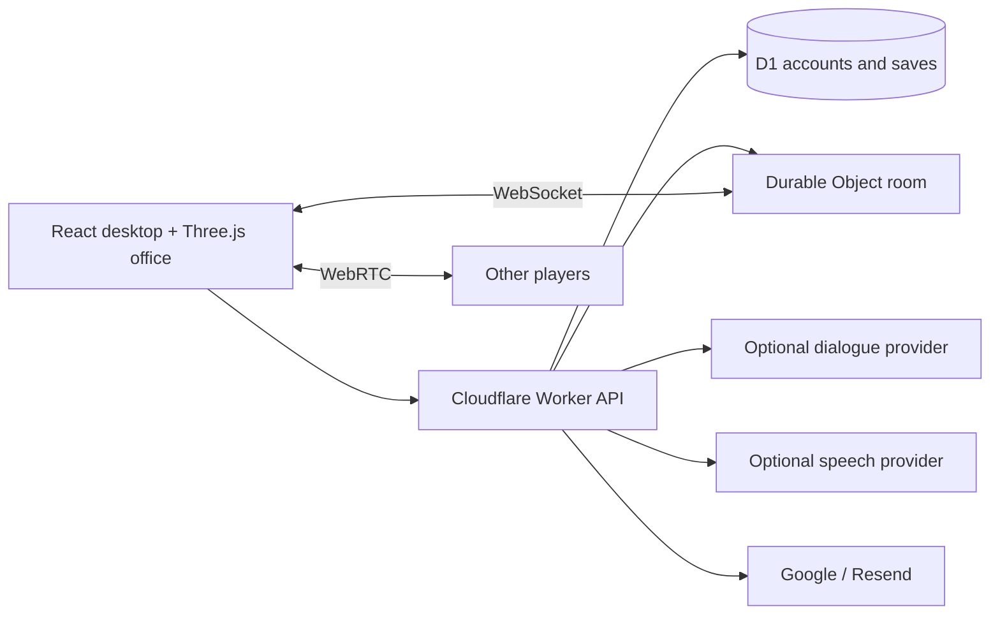

<div align="center">

# Scam With Your Friends — Web

> 友達と一緒に詐欺コールセンターを運営しよう。どんどん荒唐無稽になる手口で AI 発信者をだまし、一生分の貯蓄を巻き上げる。1 日のノルマを達成し、オフィスを大混乱に陥れ、キレやすい上司の残酷な人事評価を生き延びよう。

<sub>原作の紹介（翻訳） · [Steam](https://store.steampowered.com/app/4954910/Scam_With_Your_Friends/)</sub>

Scam With Your Friends Web は、原作に着想を得た**非公式・オープンソースのブラウザ版**です。3D オフィスで友達と協力し、架空の AI 発信者との会話やボイスチャットを楽しみながら、毎日のノルマを目指します。React、Three.js、Cloudflare Workers を使用し、ローカル実行とセルフホストに対応しています。

### ブラウザで遊べるオンライン協力プレイのコールセンター・パーティーゲーム · 仕事シミュレーター · ブラックコメディ

**架空の AI 発信者からの電話に出て、チームとボイスチャットで連携し、時間を管理して、1 日のノルマを達成し、人事評価を乗り切ろう。**

[English](README.md) · [简体中文](README.zh-CN.md) · [Português](README.pt-BR.md) · [Español](README.es.md) · **日本語** · [フィードバック](https://github.com/mrzh7/scam-with-your-friends-web/issues/new/choose)

<p align="center">
  <a href="https://scam.gamefun.world"><strong>▶ デモをプレイ</strong></a>
  &nbsp;·&nbsp;
  <a href="#トレーラーを見る"><strong>トレーラー</strong></a>
  &nbsp;·&nbsp;
  <a href="#遊び方"><strong>ゲームプレイ</strong></a>
  &nbsp;·&nbsp;
  <a href="docs/DEPLOYMENT.md"><strong>デプロイ</strong></a>
  &nbsp;·&nbsp;
  <a href="docs/QUICKSTART.md"><strong>ドキュメント</strong></a>
</p>

<p align="center">
  <a href="LICENSE"></a>
  <a href="https://scam.gamefun.world"></a>
  
  
  
  <a href=".github/workflows/ci.yml"></a>
  <a href="https://x.com/mr_zh7"></a>
</p>

<!-- Ranking badges (uncomment when live — do not leave broken images):
  Trendshift appears only after the repo is listed at https://trendshift.io
  (replace REPO_ID with the id shown on https://trendshift.io/repositories/<id>):
  <a href="https://trendshift.io/repositories/REPO_ID" target="_blank"></a>
  Star History rank badge (works only once the repo is in their ranking):
  <a href="https://www.star-history.com/mrzh7/scam-with-your-friends-web"></a>
-->

[](docs/media/trailer-preview.gif)

</div>

## 公式ゲームに着想

**公式ストア:** [Steam の Scam With Your Friends](https://store.steampowered.com/app/4954910/Scam_With_Your_Friends/)

<p align="center">
  <a href="https://store.steampowered.com/app/4954910/Scam_With_Your_Friends/"></a>
</p>

<p align="center">
  <a href="https://store.steampowered.com/app/4954910/Scam_With_Your_Friends/"></a>
  <a href="https://store.steampowered.com/app/4954910/Scam_With_Your_Friends/"></a>
</p>
<p align="center">
  <a href="https://store.steampowered.com/app/4954910/Scam_With_Your_Friends/"></a>
  <a href="https://store.steampowered.com/app/4954910/Scam_With_Your_Friends/"></a>
</p>

本リポジトリは**非公式の無料ブラウザー実験**です。原作ではなく、公式移植でもなく、原作開発者とは**無関係**です。上記の Steam ヘッダーとスクリーンショットの著作権は権利者に属し、参照のため Steam から**ホットリンク表示**しているだけで、このリポジトリには原作画像ファイルを含めていません。[THIRD_PARTY_NOTICES.md](THIRD_PARTY_NOTICES.md) を参照してください。

**Scam With Your Friends — Web** は、[scam.gamefun.world](https://scam.gamefun.world) で遊べる非公式の無料ブラウザーリメイクです。友達と一緒に**詐欺コールセンター**を運営し、どんどん荒唐無稽になる手口で **AI 発信者**をだまし、**1 日のノルマ**を達成して**オフィスを大混乱**に陥れ、キレやすい上司の残酷な**人事評価**を生き延びます。デスクまで歩き、入力または対応があれば**音声操作**で会話し、デスクトップのタスクをこなし、最大 4 人で協力プレイできます。すべて架空です。実在の支払い情報は絶対に入力しないでください。


## スクリーンショット

[](docs/media/screenshot-wall.png)

| Three.js のオフィス | 着信デスク | メインメニュー |
| --- | --- | --- |
| 歩く、座る、買い物、配達物の受け取り | AI 発信者と話してタスクを完了 | ソロ、協力プレイのルームコード、設定 |

テスト用アカウントとオフライン会話を使い、この実装から撮影したもので、原作のゲーム映像ではありません。個別のスクリーンショット: [オフィス](docs/media/office.png)、[デスクトップ](docs/media/desktop.png)、[メニュー](docs/media/menu.png)。

## 機能

| システム | 実装 |
| --- | --- |
| オフィス | プロシージャル生成の Three.js ルーム、移動、インタラクション、機材、着席アニメーション |
| 通話 | 8 種類の AI 発信者プロフィール、信頼度/忍耐力、オフラインのスクリプト返信、オプションの AI 会話 |
| 勤務週 | 7 日間、1 日のノルマタイマー、ショップ、配達物の受け取り、インベントリ、事故、人事評価 |
| ボイス | 対応環境での音声認識による音声操作、チームボイスチャット、MiniMax または ElevenLabs によるオプションの TTS |
| 協力プレイ | 最大 4 人のオンライン協力プレイ、WebSocket による状態同期、共有の日/ノルマ、WebRTC ボイス |
| アカウント | 任意。既定では無効。Google、または Resend による認証済みメール/パスワード |
| セーブ | D1 のアカウントセーブ、リビジョン競合の検出、ローカルでの復旧/エクスポート |
| 言語 | 英語、中国語、ポルトガル語、日本語、スペイン語 |

## 遊ぶ理由

- **最大 4 人のオンライン協力プレイ** — 1 日とノルマを共有し、それぞれが自分の通話を担当。近接チームボイスにも対応。
- **AI 発信者** — 8 人の架空のキャラクター。オフラインのスクリプト返信はキー不要で動作し、自由な会話にはオプションの AI も使えます。
- **プレッシャーの中の時間管理** — 7 日間、上がり続ける 1 日のノルマ、アップグレードのあるショップ、受け取る配達物。
- **オフィスの大混乱** — ウイルス、停電、火災、摘発といった事故が日常を中断します。
- **ブラックコメディの雰囲気** — 不条理で架空のシナリオと容赦ない上司。実際の情報は一切収集しません。
- **インストール不要** — ブラウザーで動作。UI は 5 言語対応。Cloudflare の無料枠で自前ホスティングも試せます。

## トレーラーを見る

https://github.com/user-attachments/assets/4c90325b-0fb6-4102-877f-55c378ca5371

**[▶ 英語版 · 1080p 音声あり](docs/media/trailer-en.mp4)** · **[▶ 中国語字幕版](docs/media/trailer-zh-CN.mp4)** · [ポスター](docs/media/trailer-poster.jpg) · [オリジナルサウンドトラック](docs/media/trailer-score.mp3)

このプロジェクトのオフィス、キャラクター、ポートレートを使い、オリジナル音楽をつけたシネマティックなアニメーションです。セリフと動きはトレーラー用に演出されています。[絵コンテとレンダリング](marketing/trailer/README.md)。

**[ホスト版デモをプレイ → https://scam.gamefun.world](https://scam.gamefun.world)** — デモでは Google ログインまたは認証済みメールを使います。**ソースコードの既定ではアカウント機能は無効です**。

重ねて：これは [Scam With Your Friends](https://store.steampowered.com/app/4954910/Scam_With_Your_Friends/) に着想を得た**非公式**ブラウザーリメイクです。原作でも公式移植でもなく、原作開発者とは無関係です。[出典とライセンス](THIRD_PARTY_NOTICES.md)をご覧ください。タスク ID、カード、資金、イベントはすべて架空です。**実在の支払い情報は入力しないでください。**

## 遊び方

1. **デスクに座る** — WASD で移動、**E** で着席。モバイルでは画面上のコントローラーを使います。
2. **電話に出る** — AI 発信者を読み取り、信頼度と忍耐力を管理します。オフライン返信ボタン、またはオプションの AI 会話や音声を使えます。
3. **デスクトップのタスクを完了する** — 認証手順を終えてゲーム内のお金を稼ぎます(実際のカード情報は使わないでください)。
4. **買い物をして配達物を受け取る** — アップグレードはすぐにインストールされ、物理アイテムはオフィスで受け取る必要があります。
5. **シフトのタイマーが切れる前に 1 日のノルマを達成**して人事評価に合格しましょう。失敗するとそのランは終了です。協力プレイ: 最大 4 人で 1 日を共有し、**V** でチームボイス。

詳しいルール: [ゲームプレイガイド](docs/GAMEPLAY-JA.md) — ラウンドの流れ、操作、通話と信頼度、ツール、お金、ショップのアイテム、事故、協力ボイス、オーディオに関する注意。ほかの言語: [English](docs/GAMEPLAY-EN.md) · [简体中文](docs/GAMEPLAY.md) · [Português](docs/GAMEPLAY-PT.md) · [Español](docs/GAMEPLAY-ES.md)。

## クイックスタート — アカウント不要

```sh
git clone https://github.com/mrzh7/scam-with-your-friends-web.git
cd scam-with-your-friends-web
npm ci
cp .dev.vars.example .dev.vars   # PowerShell: Copy-Item .dev.vars.example .dev.vars
npm run dev
```

**http://localhost:5173** を開きます。Cloudflare へのログイン、OAuth、メールサービスは不要です。AI キーを空にしておけば、スクリプト返信でオフラインプレイができます。

`.dev.vars` でのオプションの AI 設定:

```dotenv
ACCOUNTS_ENABLED=false
AI_BASE_URL=https://api.deepseek.com
AI_MODEL=deepseek-v4-flash
AI_API_KEY=your-own-provider-key
```

進行状況は匿名クッキーでブラウザーごとに保存されます。クッキーを消去する前にバックアップをエクスポートしてください。詳細: [ローカルガイド](docs/QUICKSTART.md)。

## Cloudflare へのデプロイ

ログインを使いたい場合は **`ACCOUNTS_ENABLED=true`** を設定し、自分の D1 データベースを作成して、少なくとも 1 つの認証方法を設定したうえで、**[DEPLOYMENT.md](docs/DEPLOYMENT.md)** に従ってください。Workers + Static Assets + D1 + Durable Objects を使い、静的専用の Pages アプリではありません。プロバイダーの認証情報は含まれておらず、ソースが無料でも有料 API は課金されることがあります。

## アーキテクチャ



`src/game/` — 共有ルール、会話、セーブ、ブラウザーのトランスポート。`worker/` — 認証、API、プロバイダー、ルームの権威サーバー。`migrations/` — D1 スキーマ。

## 開発

```sh
npm run check          # Public-tree checks, i18n, tests, TypeScript and production build
npm test
npm run check:i18n
```

[受け入れノート](docs/ACCEPTANCE.md)、[SECURITY.md](SECURITY.md)、[データフロー](docs/PRIVACY.md)を参照してください。既知の制限: モバイルでは WebGL と音声認識の挙動が異なります。決済システムはありません。クライアントから送信されるソロのセーブは、現実のお金に関わる報酬には適していません。

## フィードバックとコミュニティ

バグを見つけた、またはアイデアがありますか？ お知らせください：

- [バグを報告](https://github.com/mrzh7/scam-with-your-friends-web/issues/new?template=bug_report.yml)
- [機能をリクエスト](https://github.com/mrzh7/scam-with-your-friends-web/issues/new?template=feature_request.yml)
- [ディスカッション（質問・アイデア）](https://github.com/mrzh7/scam-with-your-friends-web/discussions)
- [セキュリティポリシー](SECURITY.md)
- 連絡: X [@mr_zh7](https://x.com/mr_zh7)

## コントリビューション

歓迎する分野: モバイル対応、自然な翻訳、アクセシビリティ、安定したボイス再接続。[CONTRIBUTING.md](CONTRIBUTING.md) を参照してください。セキュリティ上の問題: [SECURITY.md](SECURITY.md)。

## コーヒーをおごる ☕

<p align="center">このプロジェクトで楽しめたら、コーヒー1杯おごってください。投げ銭は**完全に任意**で、特典も返金もありません。非公式のファンプロジェクトで、原作ゲームとは無関係です。</p>

<table width="100%"><tr>
<td width="33%" align="center" valign="top">
<a href="docs/donate/eth-qr.png"></a><br/>
<b>ETH</b><br/>
<sub>Ethereum / EVM — 送金前にチェーンを確認</sub>
</td>
<td width="33%" align="center" valign="top">
<a href="docs/donate/btc-qr.png"></a><br/>
<b>BTC</b><br/>
<sub>ビットコイン</sub>
</td>
<td width="33%" align="center" valign="top">
<a href="docs/donate/bnb-qr.png"></a><br/>
<b>BNB</b><br/>
<sub>BNB Smart Chain（BEP20）のみ</sub>
</td>
</tr></table>

<p align="center">⚠️ 上の QR をスキャンしてください。投げ銭は任意です。新しいアドレスを DM で送ることはありません — この README のコードだけを信頼してください。</p>

## よくある質問

### 公式の Scam With Your Friends ですか？

いいえ。個人が制作した非公式の Web リメイクで、原作の開発チームとは関係ありません。Steam 版や公式移植版ではありません。

### アカウントや AI API キーは必要ですか？

最初は不要です。ソースコードではアカウント機能が初期設定で無効になっており、オフラインの台本付き通話を利用できます。AI 自由会話と任意のクラウド TTS にはサービスの設定が必要で、利用料が発生する場合があります。[起動ガイド](docs/QUICKSTART.md)をご覧ください。

### マルチプレイ版を自分でホストできますか？

はい。協力プレイ用ルーム、WebRTC 音声、進行状況の保存を備えています。[デプロイガイド](docs/DEPLOYMENT.md)に Workers、D1、Durable Objects と任意の Google・メール認証の設定を掲載しています。

## Star 履歴

<a href="https://www.star-history.com/?type=date&amp;repos=mrzh7%2Fscam-with-your-friends-web"><picture><source media="(prefers-color-scheme: dark)" srcset="https://api.star-history.com/svg?repos=mrzh7/scam-with-your-friends-web&amp;type=Date&amp;theme=dark" /><source media="(prefers-color-scheme: light)" srcset="https://api.star-history.com/svg?repos=mrzh7/scam-with-your-friends-web&amp;type=Date" /></picture></a>

<div align="center">

### Star · シェア · コントリビュート

気に入ったら、**[リポジトリに Star](https://github.com/mrzh7/scam-with-your-friends-web)** を付け、友達と**[デモをプレイ](https://scam.gamefun.world)**して広めたり、**[X でフォロー](https://x.com/mr_zh7)**したり、issue や pull request を送ってください。

</div>

プロジェクト独自のコードは [MIT](LICENSE) です。第三者の名称、参照作品、依存ライブラリはそれぞれの権利を保持します — [THIRD_PARTY_NOTICES.md](THIRD_PARTY_NOTICES.md) を参照してください。
