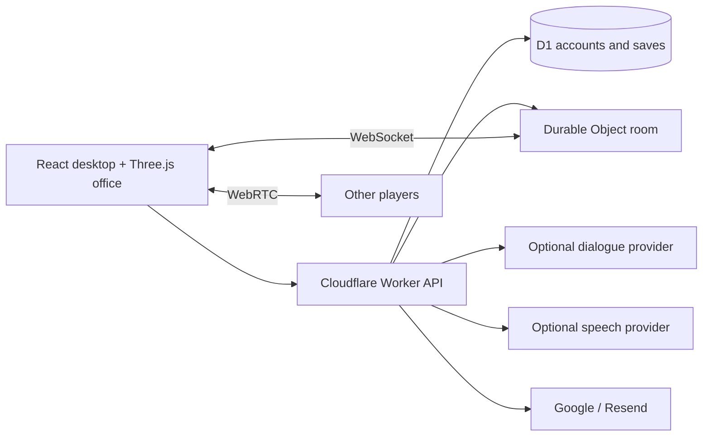

<div align="center">

# Scam With Your Friends — Web

### Online co-op call center party game · job simulator · dark comedy, in your browser

**Answer fictional AI callers, talk with your team over voice, manage your time, hit the daily quota and survive the performance review.**

**English** · [简体中文](README.zh-CN.md) · [Português](README.pt-BR.md) · [Español](README.es.md) · [日本語](README.ja.md) · [Feedback](https://github.com/mrzh7/scam-with-your-friends-web/issues/new/choose)

<p align="center">
  <a href="https://scam.gamefun.world"><strong>▶ Play Demo</strong></a>
  &nbsp;·&nbsp;
  <a href="#watch-the-trailer"><strong>Trailer</strong></a>
  &nbsp;·&nbsp;
  <a href="#how-to-play"><strong>Gameplay</strong></a>
  &nbsp;·&nbsp;
  <a href="docs/DEPLOYMENT.md"><strong>Deploy</strong></a>
  &nbsp;·&nbsp;
  <a href="docs/QUICKSTART.md"><strong>Docs</strong></a>
</p>

<p align="center">
  <a href="LICENSE"></a>
  <a href="https://scam.gamefun.world"></a>
  
  
  
  <a href=".github/workflows/ci.yml"></a>
  <a href="https://x.com/mr_zh7"></a>
</p>

<!-- Ranking badges (uncomment when live — do not leave broken images):
  Trendshift appears only after the repo is listed at https://trendshift.io
  (replace REPO_ID with the id shown on https://trendshift.io/repositories/<id>):
  <a href="https://trendshift.io/repositories/REPO_ID" target="_blank"></a>
  Star History rank badge (works only once the repo is in their ranking):
  <a href="https://www.star-history.com/mrzh7/scam-with-your-friends-web"></a>
-->

[](docs/media/trailer-preview.gif)

</div>

Scam With Your Friends — Web is an unofficial, free browser game and open-source project: an **online co-op job simulator** set in a chaotic fictional **call center**. Walk to your desk, answer **AI callers** who react to what you say (typed, or spoken with **voice control** where your browser supports it), and finish desktop tasks for in-game money. Race the clock in a **time management** loop with a **daily quota**, dodge office accidents, and face a **performance review** from the boss. It plays like a **dark comedy party game** for up to four friends. Everything is fictional; never enter real payment details.


## Screenshots

[](docs/media/screenshot-wall.png)

| Three.js office | Incoming call desk | Main menu |
| --- | --- | --- |
| Walk, sit, shop and collect deliveries | Talk to AI callers, finish the task | Solo, co-op room code, settings |

Captured from this implementation with a synthetic test account and offline dialogue — not original-game footage. Individual shots: [office](docs/media/office.png), [desktop](docs/media/desktop.png), [menu](docs/media/menu.png).

## Features

| System | Implementation |
| --- | --- |
| Office | Procedural Three.js room, movement, interaction, equipment and seated animation |
| Calls | Eight AI caller profiles, trust/patience, scripted offline responses, optional AI dialogue |
| Workweek | Seven days, daily quota timers, shop, delivery collection, inventory, accidents and performance review |
| Voice | Voice control via speech recognition where supported, team voice chat, optional MiniMax or ElevenLabs TTS |
| Co-op | Online co-op for up to four players, WebSocket state, shared day/quota and WebRTC voice |
| Accounts | Optional; disabled by default. Google or verified email/password via Resend |
| Saves | D1 account saves, revision conflict detection and local recovery/export |
| Languages | English, Chinese, Portuguese, Japanese, Spanish |

## Why play

- **Online co-op for up to four** — share the day and quota, each handling your own calls, with proximity team voice.
- **AI callers** — eight fictional personalities; offline scripted replies work without any key, optional AI for free conversation.
- **Time management under pressure** — seven days, rising daily quotas, a shop with upgrades and deliveries to collect.
- **Office chaos** — virus, blackout, fire and raid accidents break up the routine.
- **Dark comedy tone** — absurd, fictional scenarios and a ruthless boss; nothing real is collected.
- **Nothing to install** — runs in a browser; five UI languages; self-host on Cloudflare for free-tier experiments.

## Watch the trailer

https://github.com/user-attachments/assets/4c90325b-0fb6-4102-877f-55c378ca5371

**[▶ English · 1080p with sound](docs/media/trailer-en.mp4)** · **[▶ 中文字幕版](docs/media/trailer-zh-CN.mp4)** · [Poster](docs/media/trailer-poster.jpg) · [Original soundtrack](docs/media/trailer-score.mp3)

Cinematic animation built from this project's office, characters and portraits, with original music. Dialogue and action are staged for the trailer. [Storyboard and rendering](marketing/trailer/README.md).

**[Play the hosted demo → https://scam.gamefun.world](https://scam.gamefun.world)** — Google login or verified email on the demo; **source defaults to no accounts**.

This is an experimental, unofficial project inspired by [Scam With Your Friends](https://store.steampowered.com/app/4954910/) on Steam. It is not the original game or an official port, and is not affiliated with its developers. See [provenance and licenses](THIRD_PARTY_NOTICES.md). All task IDs, cards, funds and events are fictional. **Do not enter real payment details.**

## How to play

1. **Sit at your desk** — WASD to move, **E** to sit. Mobile has on-screen controls.
2. **Answer the call** — read the AI caller, manage trust and patience; use offline reply buttons, or optional AI dialogue and voice.
3. **Complete the desktop task** — finish verification steps for in-game money (never use real card data).
4. **Shop and collect deliveries** — upgrades install immediately; physical items must be picked up in the office.
5. **Hit the daily quota** before the shift timer ends and pass the performance review — miss it and the run is over. Co-op: up to four players share the day; **V** for team voice.

Full rules: [Gameplay guide](docs/GAMEPLAY-EN.md) — round loop, controls, calls and trust, tools, money, shop items, accidents, co-op voice and audio notes. Also in: [简体中文](docs/GAMEPLAY.md) · [Português](docs/GAMEPLAY-PT.md) · [Español](docs/GAMEPLAY-ES.md) · [日本語](docs/GAMEPLAY-JA.md).

## Quick start — no accounts

```sh
git clone https://github.com/mrzh7/scam-with-your-friends-web.git
cd scam-with-your-friends-web
npm ci
cp .dev.vars.example .dev.vars   # PowerShell: Copy-Item .dev.vars.example .dev.vars
npm run dev
```

Open **http://localhost:5173**. No Cloudflare login, OAuth or email service required. Leave the AI key empty for scripted offline play.

Optional AI in `.dev.vars`:

```dotenv
ACCOUNTS_ENABLED=false
AI_BASE_URL=https://api.deepseek.com
AI_MODEL=deepseek-v4-flash
AI_API_KEY=your-own-provider-key
```

Progress is per-browser via an anonymous cookie. Export backups before clearing cookies. Details: [local guide](docs/QUICKSTART.md).

## Deploy on Cloudflare

Set **`ACCOUNTS_ENABLED=true`** when you want login, create your own D1 database, configure at least one auth method, then follow **[DEPLOYMENT.md](docs/DEPLOYMENT.md)**. Workers + Static Assets + D1 + Durable Objects — not a static-only Pages app. Provider credentials are never included; paid APIs may charge even though the source is free.

## Architecture



`src/game/` — shared rules, dialogue, saves, browser transports. `worker/` — auth, API, providers, room authority. `migrations/` — D1 schema.

## Development

```sh
npm run check          # Public-tree checks, i18n, tests, TypeScript and production build
npm test
npm run check:i18n
```

See [acceptance notes](docs/ACCEPTANCE.md), [SECURITY.md](SECURITY.md) and [data flow](docs/PRIVACY.md). Known limits: mobile WebGL/speech vary; no payment system; client-submitted single-player saves are unsuitable for real-money rewards.

## Feedback & community

Found a bug or have an idea? Tell us:

- [Report a bug](https://github.com/mrzh7/scam-with-your-friends-web/issues/new?template=bug_report.yml)
- [Request a feature](https://github.com/mrzh7/scam-with-your-friends-web/issues/new?template=feature_request.yml)
- [Discussions (Q&A, ideas)](https://github.com/mrzh7/scam-with-your-friends-web/discussions)
- [Security policy](SECURITY.md)
- Contact: X [@mr_zh7](https://x.com/mr_zh7)

## Contributing

Useful areas: mobile compatibility, natural translations, accessibility and reliable voice reconnection. See [CONTRIBUTING.md](CONTRIBUTING.md). Security issues: [SECURITY.md](SECURITY.md).

## Buy me a coffee

<p align="center">If this project made you laugh, you can buy me a coffee. Tips are **voluntary**: no perks, no refunds. This is an unofficial fan project, not affiliated with the original game.</p>

<table align="center"><tr>
<td align="center" width="33%">
<a href="docs/donate/eth-qr.png"></a><br/>
<b>ETH</b><br/><sub>Ethereum mainnet (same address works on EVM chains — confirm the chain before sending)</sub><br/>
<code>0xca3E579dA2a88638AfdD8FE76bFB0CF938E73f61</code>
</td>
<td align="center" width="33%">
<a href="docs/donate/btc-qr.png"></a><br/>
<b>BTC</b><br/><sub>Bitcoin</sub><br/>
<code>bc1qkmfm4clql6n3f086v69weld77rsa49wkkd267h</code>
</td>
<td align="center" width="33%">
<a href="docs/donate/bnb-qr.png"></a><br/>
<b>BNB</b><br/><sub>BNB Smart Chain (BEP20) only</sub><br/>
<code>0xca3E579dA2a88638AfdD8FE76bFB0CF938E73f61</code>
</td>
</tr></table>

<p align="center">⚠️ Addresses are valid **only as written in this README**. I will never DM you a new address. Double-check the first and last characters before sending.</p>

## Star History

<a href="https://www.star-history.com/#mrzh7/scam-with-your-friends-web&Date"><picture><source media="(prefers-color-scheme: dark)" srcset="https://api.star-history.com/svg?repos=mrzh7/scam-with-your-friends-web&type=Date&theme=dark" /><source media="(prefers-color-scheme: light)" srcset="https://api.star-history.com/svg?repos=mrzh7/scam-with-your-friends-web&type=Date" /></picture></a>

<div align="center">

### Star · Share · Contribute

If you enjoy it, **[star the repo](https://github.com/mrzh7/scam-with-your-friends-web)**, **[play the demo](https://scam.gamefun.world)** with friends and share it, **[follow on X](https://x.com/mr_zh7)**, or open an issue or pull request.

</div>

Project-owned code is [MIT](LICENSE). Third-party names, reference works and dependencies retain their own rights — see [THIRD_PARTY_NOTICES.md](THIRD_PARTY_NOTICES.md).
