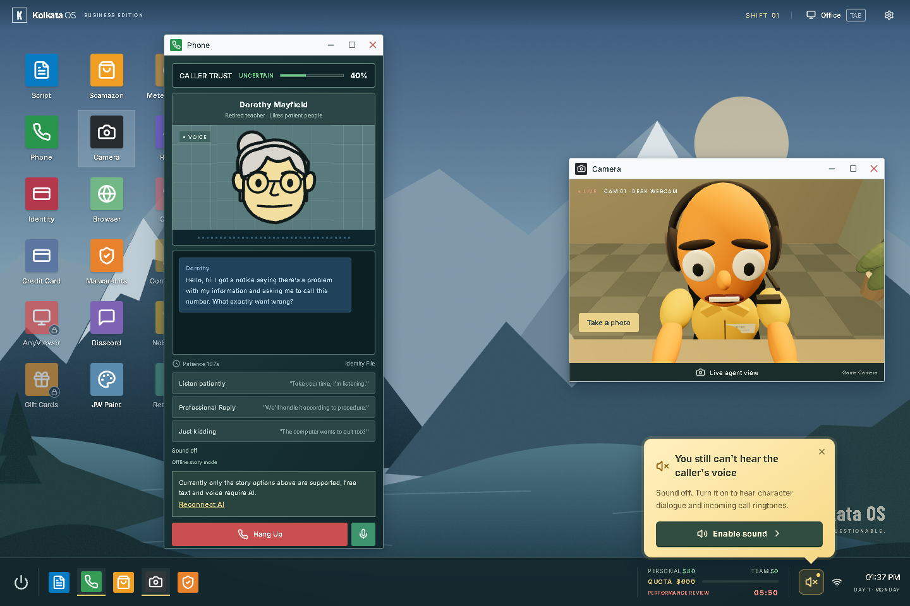
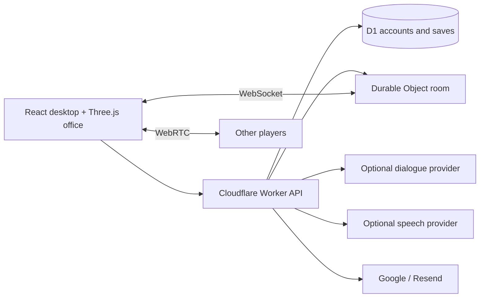

# Scam With Your Friends — Web

**A browser office game where fictional callers, awkward conversations and a ticking quota collide.**

[简体中文](README.zh-CN.md) · [Gameplay](docs/GAMEPLAY-EN.md) · [Self-hosting](docs/DEPLOYMENT.md) · [Contributing](CONTRIBUTING.md)


Walk to your desk, answer calls, complete fictional verification tasks, buy equipment and survive a seven-day workweek. Play solo with offline dialogue or configure an AI provider for free-form conversations. Cloudflare Durable Objects coordinate rooms for up to four players.

This is an experimental, unofficial project inspired by [Scam With Your Friends](https://store.steampowered.com/app/4954910/). It is not the original game or an official port. See [provenance and licenses](THIRD_PARTY_NOTICES.md). All task IDs, cards, funds and events are fictional. Do not enter real payment details.

## Watch the trailer

[](docs/media/trailer-en.mp4)

**[▶ English · 1080p with sound](docs/media/trailer-en.mp4)** · **[▶ 中文字幕版](docs/media/trailer-zh-CN.mp4)** · [Poster](docs/media/trailer-poster.jpg) · [Original soundtrack](docs/media/trailer-score.mp3)

A cinematic animation made with this project's office, characters and portraits, with original music and sound effects. The dialogue and action are staged for the trailer. [Storyboard, sources and rendering instructions](marketing/trailer/README.md).

## Play online

The maintained Cloudflare deployment is the playable demo. Its URL will be added before publication. Google login or verified email registration is required; use only fictional game data during play. The hosted deployment may have different operator configuration from a self-hosted fork.

## Develop or self-host

Requires Node.js 24 and npm.

```sh
git clone https://github.com/mrzh7/scam-with-your-friends-web.git
cd scam-with-your-friends-web
npm ci
npm test
npm run build
```

To run the full application, configure your own Cloudflare database and authentication following [DEPLOYMENT.md](docs/DEPLOYMENT.md). There is no guest or simulated-account demo in this repository. The offline dialogue option still works inside the authenticated game when no AI provider is configured.

## What is implemented

| System | Implementation |
| --- | --- |
| Office | Procedural Three.js room, movement, interaction, equipment and seated character animation |
| Calls | Eight caller profiles, trust/patience, scripted offline responses, optional AI dialogue |
| Workweek | Seven days, timed quotas, shop, delivery collection, inventory, accidents and performance review |
| Voice | Speech recognition where supported, browser speech, optional MiniMax or ElevenLabs TTS; mute skips cloud TTS |
| Co-op | Up to four players, WebSocket state, shared day/quota and WebRTC voice; TURN configuration for reliable relay |
| Accounts | Google login or verified email/password via Resend; hidden WeChat UI with server adapter retained |
| Saves | D1 account saves, revision conflict detection and local recovery/export |
| Languages | English, Chinese, Portuguese, Japanese, Spanish; environment detection and manual override |
| Admin | Server-authorized provider configuration; administrator is a configured, verified Google identity |

## Screenshots



Captured from this implementation using a synthetic test account and offline dialogue; this is not original-game footage.

## Full deployment

Use **Cloudflare Workers with Static Assets**, D1 and SQLite-backed Durable Objects. This is not a static-only Pages application.

1. Create your own D1 database and set its ID in `wrangler.jsonc`.
2. Configure a canonical HTTPS origin and at least one login method.
3. Add server secrets for the providers you actually want to use.
4. Apply migrations and deploy. Connect a private deployment fork to Workers Builds for automatic releases.

Follow the exact commands and callback URLs in [DEPLOYMENT.md](docs/DEPLOYMENT.md). AI text, speech, email and Google OAuth have **separate credentials**. No provider credentials are included. Paid services may charge even when the source code is free.

## Architecture



`src/game/` contains shared game rules, dialogue contracts, saves and browser transports. `worker/` contains authentication, API endpoints, provider adapters and room authority. `migrations/` contains D1 schema changes. 

## Development and checks

```sh
npm run check          # Public-tree checks, i18n, tests, TypeScript and production build
npm test              # Unit and integration tests with mocked external providers
npm run check:i18n
```

Tests do not spend provider credits or prove compatibility with every phone. Test microphone permissions, WebGL recovery and cross-network co-op on real target devices before promising support. See [acceptance notes](docs/ACCEPTANCE.md).

Known limits: mobile WebGL/speech support varies; speech recognition may use browser-vendor services; no payment system is implemented; single-player saves are client-submitted and are unsuitable for real-money rewards. Provider rate limits are not hard spending caps. See [SECURITY.md](SECURITY.md) and [data flow](docs/PRIVACY.md).

## Contribute

Useful areas are mobile compatibility, natural translations, accessibility and reliable voice reconnection. See [CONTRIBUTING.md](CONTRIBUTING.md). If you find the project useful, a star helps other developers find it; reproducible bug reports and contributions are just as welcome.

Project-owned code is released under [MIT](LICENSE). Third-party names, reference works and dependencies retain their own rights and licenses.
