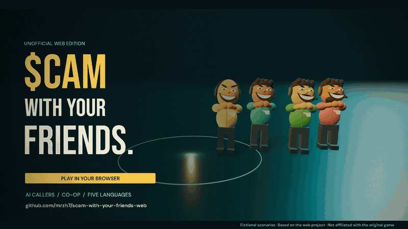
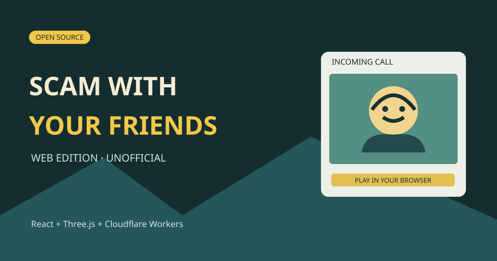
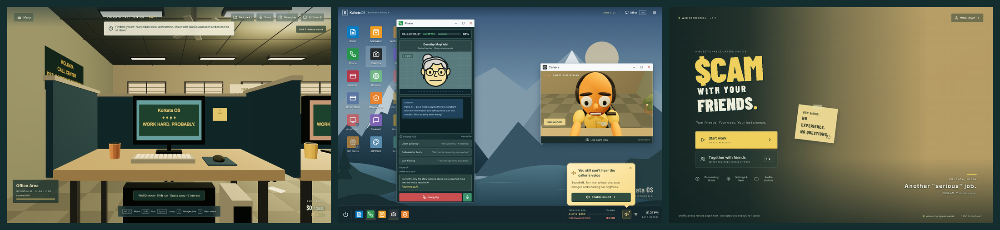
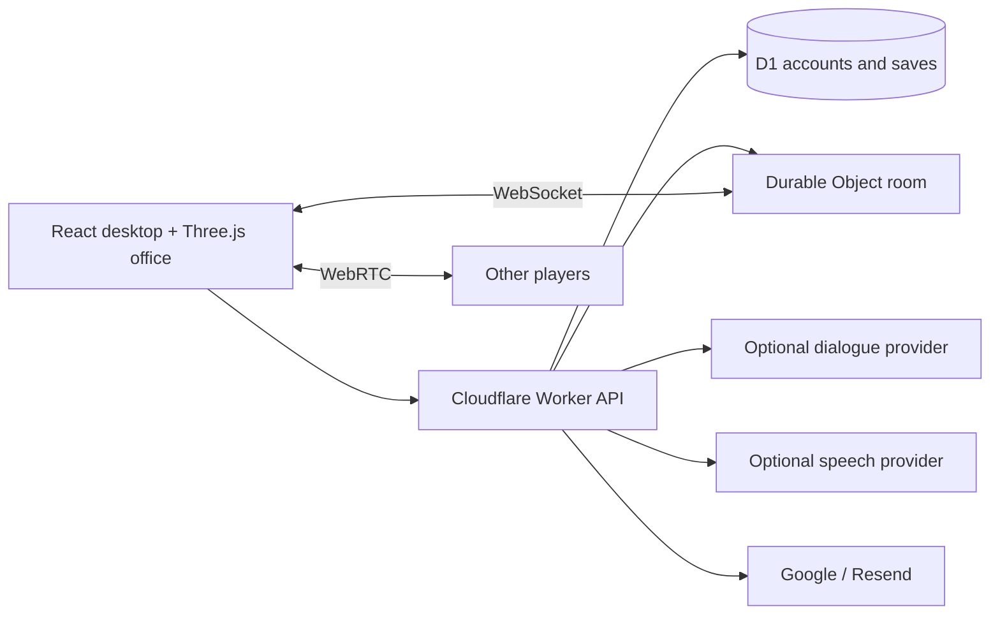
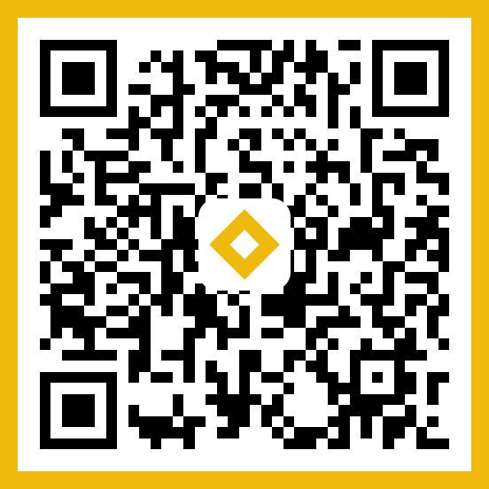

<div align="center">

# Scam With Your Friends — Web

### Jogo de festa co-op online de call center · simulador de trabalho · comédia sombria, direto no navegador

**Atenda chamadores de IA fictícios, converse por voz com sua equipe, gerencie o tempo, bata a meta diária e sobreviva à avaliação de desempenho.**

[English](README.md) · [简体中文](README.zh-CN.md) · **Português** · [Español](README.es.md) · [日本語](README.ja.md) · [Comentários](https://github.com/mrzh7/scam-with-your-friends-web/issues/new/choose)

<p align="center">
  <a href="https://scam.gamefun.world"><strong>▶ Jogar a demo</strong></a>
  &nbsp;·&nbsp;
  <a href="#assista-ao-trailer"><strong>Trailer</strong></a>
  &nbsp;·&nbsp;
  <a href="#como-jogar"><strong>Jogabilidade</strong></a>
  &nbsp;·&nbsp;
  <a href="docs/DEPLOYMENT.md"><strong>Deploy</strong></a>
  &nbsp;·&nbsp;
  <a href="docs/QUICKSTART.md"><strong>Documentação</strong></a>
</p>

<p align="center">
  <a href="LICENSE"></a>
  <a href="https://scam.gamefun.world"></a>
  
  
  
  <a href=".github/workflows/ci.yml"></a>
  <a href="https://x.com/mr_zh7"></a>
</p>

<!-- Ranking badges (uncomment when live — do not leave broken images):
  Trendshift appears only after the repo is listed at https://trendshift.io
  (replace REPO_ID with the id shown on https://trendshift.io/repositories/<id>):
  <a href="https://trendshift.io/repositories/REPO_ID" target="_blank"></a>
  Star History rank badge (works only once the repo is in their ranking):
  <a href="https://www.star-history.com/mrzh7/scam-with-your-friends-web"></a>
-->

[](docs/media/trailer-preview.gif)

</div>

Scam With Your Friends — Web é um jogo de navegador gratuito, não oficial, e um projeto de código aberto: um **simulador de trabalho co-op online** ambientado em um **call center** fictício e caótico. Vá até a sua mesa, atenda **chamadores de IA** que reagem ao que você diz (digitado, ou falado com **controle por voz** quando o navegador oferece suporte) e conclua tarefas no computador para ganhar dinheiro dentro do jogo. Corra contra o relógio em um ciclo de **gestão de tempo** com **meta diária**, desvie de acidentes no escritório e encare a **avaliação de desempenho** do chefe. É um **jogo de festa de comédia sombria** para até quatro amigos. Tudo é fictício; nunca informe dados reais de pagamento.



## Capturas de tela

[](docs/media/screenshot-wall.png)

| Escritório em Three.js | Mesa de chamadas | Menu principal |
| --- | --- | --- |
| Ande, sente, compre e retire entregas | Converse com chamadores de IA e conclua a tarefa | Solo, código de sala co-op, configurações |

Capturadas desta implementação com uma conta de teste sintética e diálogo offline — não são imagens do jogo original. Imagens individuais: [escritório](docs/media/office.png), [desktop](docs/media/desktop.png), [menu](docs/media/menu.png).

## Recursos

| Sistema | Implementação |
| --- | --- |
| Escritório | Sala procedural em Three.js, movimento, interação, equipamentos e animação sentado |
| Chamadas | Oito perfis de chamadores de IA, confiança/paciência, respostas offline roteirizadas, diálogo por IA opcional |
| Semana de trabalho | Sete dias, cronômetros de meta diária, loja, retirada de entregas, inventário, acidentes e avaliação de desempenho |
| Voz | Controle por voz via reconhecimento de fala quando houver suporte, chat de voz da equipe, TTS opcional com MiniMax ou ElevenLabs |
| Co-op | Co-op online para até quatro jogadores, estado via WebSocket, dia/meta compartilhados e voz WebRTC |
| Contas | Opcional; desativadas por padrão. Google ou e-mail/senha verificado via Resend |
| Saves | Saves de conta no D1, detecção de conflito de revisão e recuperação/exportação local |
| Idiomas | Inglês, chinês, português, japonês, espanhol |

## Por que jogar

- **Co-op online para até quatro** — compartilhem o dia e a meta, cada um cuidando das próprias chamadas, com voz de equipe por proximidade.
- **Chamadores de IA** — oito personalidades fictícias; as respostas offline roteirizadas funcionam sem nenhuma chave, e há IA opcional para conversa livre.
- **Gestão de tempo sob pressão** — sete dias, metas diárias crescentes, uma loja com melhorias e entregas para retirar.
- **Caos no escritório** — acidentes de vírus, apagão, incêndio e batida policial quebram a rotina.
- **Tom de comédia sombria** — cenários absurdos e fictícios e um chefe implacável; nada real é coletado.
- **Nada para instalar** — roda no navegador; cinco idiomas de interface; hospede você mesmo no Cloudflare para experimentos no plano gratuito.

## Assista ao trailer

https://github.com/user-attachments/assets/4c90325b-0fb6-4102-877f-55c378ca5371

**[▶ Inglês · 1080p com som](docs/media/trailer-en.mp4)** · **[▶ Versão com legendas em chinês](docs/media/trailer-zh-CN.mp4)** · [Pôster](docs/media/trailer-poster.jpg) · [Trilha sonora original](docs/media/trailer-score.mp3)

Animação cinematográfica feita com o escritório, os personagens e os retratos deste projeto, com música original. Diálogos e ações são encenados para o trailer. [Storyboard e renderização](marketing/trailer/README.md).

**[Jogue a demo hospedada → https://scam.gamefun.world](https://scam.gamefun.world)** — login com Google ou e-mail verificado na demo; **o código-fonte vem, por padrão, sem contas**.

Este é um projeto experimental e não oficial, inspirado em [Scam With Your Friends](https://store.steampowered.com/app/4954910/) na Steam. Não é o jogo original nem um port oficial, e não tem qualquer vínculo com seus desenvolvedores. Veja [procedência e licenças](THIRD_PARTY_NOTICES.md). Todos os IDs de tarefa, cartões, fundos e eventos são fictícios. **Não informe dados reais de pagamento.**

## Como jogar

1. **Sente na sua mesa** — WASD para andar, **E** para sentar. No celular há controles na tela.
2. **Atenda a chamada** — leia o chamador de IA, gerencie confiança e paciência; use os botões de resposta offline, ou o diálogo por IA e a voz (opcionais).
3. **Conclua a tarefa no computador** — finalize as etapas de verificação para ganhar dinheiro no jogo (nunca use dados reais de cartão).
4. **Compre e retire as entregas** — melhorias de software são instaladas na hora; itens físicos precisam ser retirados no escritório.
5. **Bata a meta diária** antes de o cronômetro do turno acabar e passe na avaliação de desempenho — se falhar, a partida termina. Co-op: até quatro jogadores dividem o dia; **V** para a voz da equipe.

Regras completas: [Guia de jogabilidade](docs/GAMEPLAY-PT.md) — ciclo da rodada, controles, chamadas e confiança, ferramentas, dinheiro, itens da loja, acidentes, voz co-op e notas de áudio. Também disponível em: [English](docs/GAMEPLAY-EN.md) · [简体中文](docs/GAMEPLAY.md) · [Español](docs/GAMEPLAY-ES.md) · [日本語](docs/GAMEPLAY-JA.md).

## Início rápido — sem contas

```sh
git clone https://github.com/mrzh7/scam-with-your-friends-web.git
cd scam-with-your-friends-web
npm ci
cp .dev.vars.example .dev.vars   # PowerShell: Copy-Item .dev.vars.example .dev.vars
npm run dev
```

Abra **http://localhost:5173**. Não é preciso login no Cloudflare, OAuth nem serviço de e-mail. Deixe a chave de IA vazia para jogar offline com respostas roteirizadas.

IA opcional em `.dev.vars`:

```dotenv
ACCOUNTS_ENABLED=false
AI_BASE_URL=https://api.deepseek.com
AI_MODEL=deepseek-v4-flash
AI_API_KEY=your-own-provider-key
```

O progresso fica por navegador, via um cookie anônimo. Exporte backups antes de limpar os cookies. Detalhes: [guia local](docs/QUICKSTART.md).

## Deploy no Cloudflare

Defina **`ACCOUNTS_ENABLED=true`** quando quiser login, crie seu próprio banco D1, configure ao menos um método de autenticação e siga o **[DEPLOYMENT.md](docs/DEPLOYMENT.md)**. Workers + Static Assets + D1 + Durable Objects — não é um app só estático no Pages. As credenciais de provedores nunca são incluídas; APIs pagas podem cobrar mesmo que o código seja gratuito.

## Arquitetura



`src/game/` — regras compartilhadas, diálogo, saves, transportes do navegador. `worker/` — autenticação, API, provedores, autoridade da sala. `migrations/` — esquema do D1.

## Desenvolvimento

```sh
npm run check          # Public-tree checks, i18n, tests, TypeScript and production build
npm test
npm run check:i18n
```

Veja as [notas de aceitação](docs/ACCEPTANCE.md), o [SECURITY.md](SECURITY.md) e o [fluxo de dados](docs/PRIVACY.md). Limitações conhecidas: WebGL e fala variam no celular; não há sistema de pagamento; saves de jogo solo enviados pelo cliente não servem para recompensas com dinheiro real.

## Comentários e comunidade

Encontrou um bug ou tem uma ideia? Conte para a gente:

- [Reportar um bug](https://github.com/mrzh7/scam-with-your-friends-web/issues/new?template=bug_report.yml)
- [Sugerir um recurso](https://github.com/mrzh7/scam-with-your-friends-web/issues/new?template=feature_request.yml)
- [Discussões (perguntas e ideias)](https://github.com/mrzh7/scam-with-your-friends-web/discussions)
- [Política de segurança](SECURITY.md)
- Contato: X [@mr_zh7](https://x.com/mr_zh7)

## Contribuindo

Áreas úteis: compatibilidade com celulares, traduções naturais, acessibilidade e reconexão de voz confiável. Veja o [CONTRIBUTING.md](CONTRIBUTING.md). Problemas de segurança: [SECURITY.md](SECURITY.md).

## Me pague um café ☕

<p align="center">Se o projeto te divertiu, você pode me pagar um café. A gorjeta é **voluntária**: sem vantagens e sem reembolso. Projeto de fã não oficial, sem vínculo com o jogo original.</p>

<table align="center"><tr>
<td align="center" width="33%">
<a href="docs/donate/eth-qr.png"></a><br/>
<b>ETH</b><br/><sub>Ethereum mainnet (o mesmo endereço funciona em redes EVM — confirme a rede antes de enviar)</sub><br/>
<code>0xca3E579dA2a88638AfdD8FE76bFB0CF938E73f61</code>
</td>
<td align="center" width="33%">
<a href="docs/donate/btc-qr.png"></a><br/>
<b>BTC</b><br/><sub>Bitcoin</sub><br/>
<code>bc1qkmfm4clql6n3f086v69weld77rsa49wkkd267h</code>
</td>
<td align="center" width="33%">
<a href="docs/donate/bnb-qr.png"></a><br/>
<b>BNB</b><br/><sub>somente BNB Smart Chain (BEP20)</sub><br/>
<code>0xca3E579dA2a88638AfdD8FE76bFB0CF938E73f61</code>
</td>
</tr></table>

<p align="center">⚠️ Os endereços valem **somente como escritos neste README**. Nunca enviarei um novo endereço por mensagem privada. Confira o início e o fim do endereço antes de enviar.</p>

## Histórico de Stars

<a href="https://www.star-history.com/#mrzh7/scam-with-your-friends-web&Date"><picture><source media="(prefers-color-scheme: dark)" srcset="https://api.star-history.com/svg?repos=mrzh7/scam-with-your-friends-web&type=Date&theme=dark" /><source media="(prefers-color-scheme: light)" srcset="https://api.star-history.com/svg?repos=mrzh7/scam-with-your-friends-web&type=Date" /></picture></a>

<div align="center">

### Star · Compartilhe · Contribua

Se você curtiu, dê uma **[estrela no repositório](https://github.com/mrzh7/scam-with-your-friends-web)**, **[jogue a demo](https://scam.gamefun.world)** com os amigos e compartilhe, **[siga no X](https://x.com/mr_zh7)**, ou abra uma issue ou pull request.

</div>

O código próprio do projeto é [MIT](LICENSE). Nomes de terceiros, obras de referência e dependências mantêm seus próprios direitos — veja [THIRD_PARTY_NOTICES.md](THIRD_PARTY_NOTICES.md).
