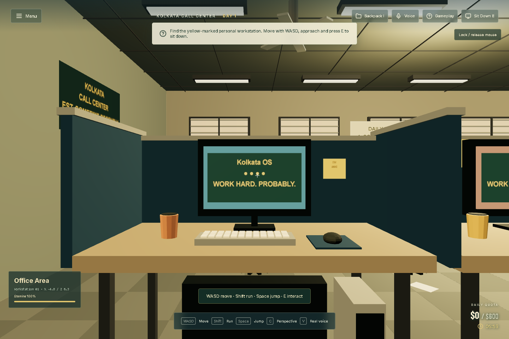
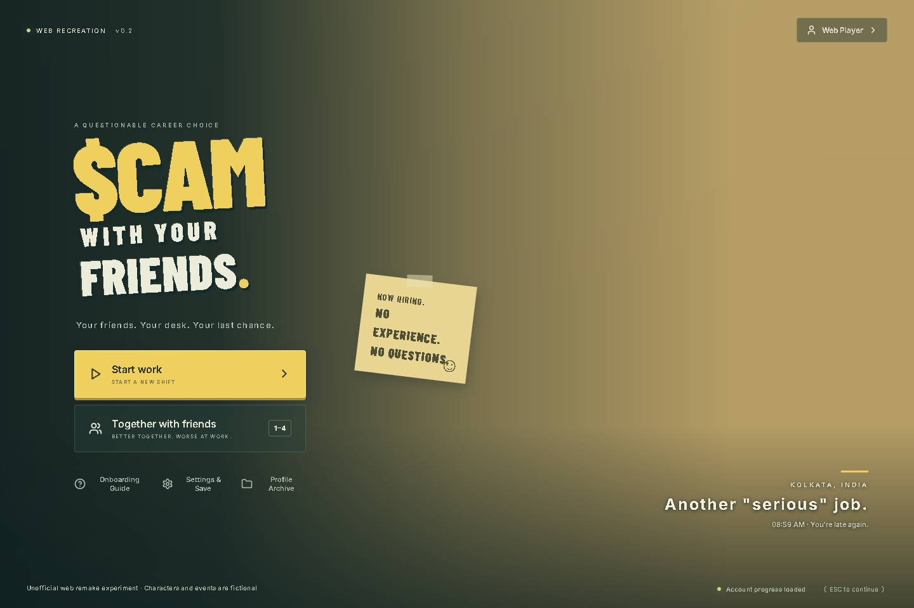
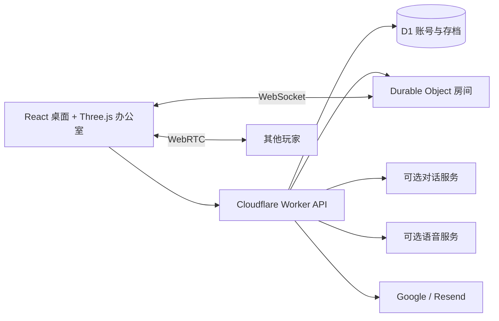

# Scam With Your Friends — Web

**浏览器联机办公室游戏：走到工位、接听虚构来电，和朋友一起在下班前冲业绩。**

[English](README.md) · [简体中文](README.zh-CN.md)

<p align="center">
  <a href="https://scam.gamefun.world"><strong>▶ 立即试玩</strong></a>
  &nbsp;·&nbsp;
  <a href="#宣传动画"><strong>宣传片</strong></a>
  &nbsp;·&nbsp;
  <a href="#怎么玩"><strong>玩法</strong></a>
  &nbsp;·&nbsp;
  <a href="docs/DEPLOYMENT.zh-CN.md"><strong>部署</strong></a>
  &nbsp;·&nbsp;
  <a href="docs/QUICKSTART.zh-CN.md"><strong>文档</strong></a>
</p>

<p align="center">
  <a href="LICENSE"></a>
  <a href="https://scam.gamefun.world"></a>
  
  
  
  <a href=".github/workflows/ci.yml"></a>
</p>


## 宣传动画

https://github.com/user-attachments/assets/5013ead8-cf12-4d1b-89f5-1818df086993

**[▶ 中文字幕版 · 1080p，含音乐与音效](docs/media/trailer-zh-CN.mp4)** · **[▶ English 原版](docs/media/trailer-en.mp4)** · [宣传海报](docs/media/trailer-poster.jpg) · [原创配乐](docs/media/trailer-score.mp3)

使用本项目办公室、角色和头像制作的电影式宣传动画，配有原创音乐。镜头与对话经过编排。[分镜与制作说明](marketing/trailer/README.md)。

**[立即试玩 → https://scam.gamefun.world](https://scam.gamefun.world)** — 线上试玩站需 Google 登录或验证邮箱；**开源代码默认不启用账户**。

这是受《Scam With Your Friends》启发的非官方网页实验，不是原作，也不是官方移植。见 [素材来源与许可证](THIRD_PARTY_NOTICES.md)。游戏里的卡片、任务编号和资金均为虚构，**请勿输入真实支付资料**。

## 怎么玩

1. **坐到工位** — WASD 移动，**E** 入座；手机有虚拟摇杆。
2. **接听来电** — 管理信任与耐心；可用离线回复按钮，或可选大模型自由对话。
3. **完成桌面任务** — 走完验证步骤才赚到游戏币（切勿使用真实银行卡信息）。
4. **购物与取货** — 软件立即生效；实体物品需在办公室领取后使用。
5. **在班次结束前达成当日业绩** — 未达标则本局结束。联机最多四人共享天数；**V** 开启队友语音。

完整规则见 [玩法说明](docs/GAMEPLAY.md)。

## 界面预览

| 来电桌面 | Three.js 办公室 | 主菜单 |
| --- | --- | --- |
| [](https://scam.gamefun.world) | [](https://scam.gamefun.world) | [](https://scam.gamefun.world) |

截图来自本仓库实现，使用虚构测试账号和离线对话，不是原作画面。

预览动图：


## 功能一览

| 系统 | 实现 |
| --- | --- |
| 办公室 | 程序化 Three.js 场景、走动、互动、道具与入座动画 |
| 来电 | 八个来电角色、信任/耐心、离线剧情、可选 AI 对话 |
| 工作周 | 七天目标、限时业绩、商店、配送、背包、事故与考核 |
| 语音 | 浏览器语音识别/合成，可选 MiniMax 或 ElevenLabs TTS |
| 联机 | 最多四人、WebSocket 同步、共享天数/业绩与 WebRTC 语音 |
| 账户 | 可选，默认关闭；Google 或验证邮箱/密码（Resend） |
| 存档 | D1 账号存档、冲突检测与本地恢复/导出 |
| 语言 | 英语、中文、葡语、日语、西语 |

## 本机快速开始 — 无需账户

```sh
git clone https://github.com/mrzh7/scam-with-your-friends-web.git
cd scam-with-your-friends-web
npm ci
cp .dev.vars.example .dev.vars   # PowerShell: Copy-Item .dev.vars.example .dev.vars
npm run dev
```

浏览器打开 **http://localhost:5173**。无需 Cloudflare 账号、OAuth 或邮件服务。不填 AI 密钥也可玩离线剧情。

可选 AI 配置示例（`.dev.vars`）：

```dotenv
ACCOUNTS_ENABLED=false
AI_BASE_URL=https://api.deepseek.com
AI_MODEL=deepseek-v4-flash
AI_API_KEY=你的服务商密钥
```

进度按浏览器匿名会话隔离；清除 Cookie 前请导出存档。详见 [本机快速开始](docs/QUICKSTART.zh-CN.md)。

## 部署到 Cloudflare

需要登录时设置 **`ACCOUNTS_ENABLED=true`**，创建自己的 D1，配置至少一种登录方式，再按 **[部署指南](docs/DEPLOYMENT.zh-CN.md)** 操作。需要 Workers + 静态资源 + D1 + Durable Objects，不能只上传静态文件到 Pages。公开源码不含生产凭据；付费 API 费用由部署者承担。

## 架构



`src/game/` — 共享规则、对话、存档与浏览器传输。`worker/` — 鉴权、API、服务适配与房间权威。`migrations/` — D1 结构变更。

## 开发与检查

```sh
npm run check
npm test
npm run check:i18n
```

限制说明见 [验收说明](docs/ACCEPTANCE.md)、[SECURITY.md](SECURITY.md) 与 [数据流](docs/PRIVACY.md)。手机 WebGL/语音因设备而异；无支付系统；单人存档由客户端提交，不适合真实金钱奖励。

## 参与贡献

欢迎改进手机体验、翻译、无障碍和语音稳定性。见 [贡献说明](CONTRIBUTING.md)。安全问题请按 [SECURITY.md](SECURITY.md) 私下反馈。

觉得有用可以点 Star；清晰的反馈和代码贡献同样重要。

项目自有代码采用 [MIT](LICENSE)。第三方名称、参考作品与依赖保留各自权利，见 [THIRD_PARTY_NOTICES.md](THIRD_PARTY_NOTICES.md)。
