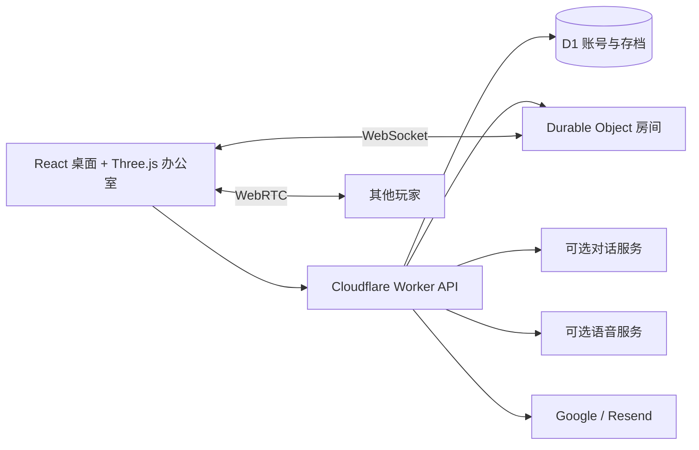

<div align="center">

# Scam With Your Friends — Web

### 浏览器在线合作呼叫中心派对游戏 · 职场模拟 · 黑色幽默

**接听虚构 AI 来电，和队友语音协作，管理时间，达成每日业绩并撑过绩效考核。**

[English](README.md) · **简体中文** · [Português](README.pt-BR.md) · [Español](README.es.md) · [日本語](README.ja.md) · [问题反馈](https://github.com/mrzh7/scam-with-your-friends-web/issues/new/choose)

<p align="center">
  <a href="https://scam.gamefun.world"><strong>▶ 立即试玩</strong></a>
  &nbsp;·&nbsp;
  <a href="#宣传动画"><strong>宣传片</strong></a>
  &nbsp;·&nbsp;
  <a href="#怎么玩"><strong>玩法</strong></a>
  &nbsp;·&nbsp;
  <a href="docs/DEPLOYMENT.zh-CN.md"><strong>部署</strong></a>
  &nbsp;·&nbsp;
  <a href="docs/QUICKSTART.zh-CN.md"><strong>文档</strong></a>
</p>

<p align="center">
  <a href="LICENSE"></a>
  <a href="https://scam.gamefun.world"></a>
  
  
  
  <a href=".github/workflows/ci.yml"></a>
</p>

[](https://scam.gamefun.world)

</div>

《Scam With Your Friends — Web》是一款非官方、免费的开源网页游戏：在混乱的虚构**呼叫中心**里玩**在线合作**的**职场模拟**。走到工位，接听会根据你的话做出反应的 **AI 来电**（打字，或在浏览器支持时用**语音控制**），完成桌面任务赚取游戏币。在**时间管理**循环中追赶**每日业绩**，应对办公室事故，迎接老板的**绩效考核**。最多四位好友一起玩，是一款**黑色幽默派对游戏**。所有内容均为虚构，请勿输入真实支付资料。


## 界面预览

[](https://scam.gamefun.world)

| Three.js 办公室 | 来电桌面 | 主菜单 |
| --- | --- | --- |
| 走动、入座、购物、取货 | 与 AI 来电者交流并完成任务 | 单人、联机房间码、设置 |

截图来自本仓库实现，使用虚构测试账号和离线对话，不是原作画面。单张：[办公室](docs/media/office.png)、[桌面](docs/media/desktop.png)、[菜单](docs/media/menu.png)。

## 功能一览

| 系统 | 实现 |
| --- | --- |
| 办公室 | 程序化 Three.js 场景、走动、互动、道具与入座动画 |
| 来电 | 八个 AI 来电角色、信任/耐心、离线剧情、可选 AI 对话 |
| 工作周 | 七天每日业绩目标、限时、商店、配送、背包、事故与绩效考核 |
| 语音 | 语音控制（浏览器识别）、队友语音聊天，可选 MiniMax 或 ElevenLabs TTS |
| 联机 | 最多四人在线合作、WebSocket 同步、共享天数/业绩与 WebRTC 语音 |
| 账户 | 可选，默认关闭；Google 或验证邮箱/密码（Resend） |
| 存档 | D1 账号存档、冲突检测与本地恢复/导出 |
| 语言 | 英语、中文、葡语、日语、西语 |

## 为什么好玩

- **最多四人在线合作** — 共享天数与业绩，各自处理来电，支持就近队友语音。
- **AI 来电** — 八种虚构性格；无需密钥即可用离线剧情，也可启用 AI 自由对话。
- **高压时间管理** — 七天、递增的每日业绩、商店升级与需要领取的配送。
- **办公室混乱** — 病毒、停电、火灾和突袭打乱节奏。
- **黑色幽默基调** — 荒诞的虚构情景和严厉的老板，不收集任何真实资料。
- **无需安装** — 浏览器即玩，支持五种界面语言，可自部署到 Cloudflare。

## 宣传动画

https://github.com/user-attachments/assets/5013ead8-cf12-4d1b-89f5-1818df086993

**[▶ 中文字幕版 · 1080p，含音乐与音效](docs/media/trailer-zh-CN.mp4)** · **[▶ English 原版](docs/media/trailer-en.mp4)** · [宣传海报](docs/media/trailer-poster.jpg) · [原创配乐](docs/media/trailer-score.mp3)

使用本项目办公室、角色和头像制作的电影式宣传动画，配有原创音乐。镜头与对话经过编排。[分镜与制作说明](marketing/trailer/README.md)。

**[立即试玩 → https://scam.gamefun.world](https://scam.gamefun.world)** — 线上试玩站需 Google 登录或验证邮箱；**开源代码默认不启用账户**。

这是受 Steam 上《[Scam With Your Friends](https://store.steampowered.com/app/4954910/)》启发的非官方网页实验，不是原作，也不是官方移植，与原作开发者无关。见 [素材来源与许可证](THIRD_PARTY_NOTICES.md)。游戏里的卡片、任务编号和资金均为虚构，**请勿输入真实支付资料**。

## 怎么玩

1. **坐到工位** — WASD 移动，**E** 入座；手机有虚拟摇杆。
2. **接听来电** — 观察 AI 来电者，管理信任与耐心；可用离线回复按钮，或可选大模型对话与语音。
3. **完成桌面任务** — 走完验证步骤才赚到游戏币（切勿使用真实银行卡信息）。
4. **购物与取货** — 软件立即生效；实体物品需在办公室领取后使用。
5. **在班次结束前达成每日业绩**并通过绩效考核 — 未达标则本局结束。联机最多四人共享天数；**V** 开启队友语音。

完整规则见 [玩法说明](docs/GAMEPLAY.md)（其他语言：[English](docs/GAMEPLAY-EN.md) · [Português](docs/GAMEPLAY-PT.md) · [Español](docs/GAMEPLAY-ES.md) · [日本語](docs/GAMEPLAY-JA.md)）。

## 本机快速开始 — 无需账户

```sh
git clone https://github.com/mrzh7/scam-with-your-friends-web.git
cd scam-with-your-friends-web
npm ci
cp .dev.vars.example .dev.vars   # PowerShell: Copy-Item .dev.vars.example .dev.vars
npm run dev
```

浏览器打开 **http://localhost:5173**。无需 Cloudflare 账号、OAuth 或邮件服务。不填 AI 密钥也可玩离线剧情。

可选 AI 配置示例（`.dev.vars`）：

```dotenv
ACCOUNTS_ENABLED=false
AI_BASE_URL=https://api.deepseek.com
AI_MODEL=deepseek-v4-flash
AI_API_KEY=你的服务商密钥
```

进度按浏览器匿名会话隔离；清除 Cookie 前请导出存档。详见 [本机快速开始](docs/QUICKSTART.zh-CN.md)。

## 部署到 Cloudflare

需要登录时设置 **`ACCOUNTS_ENABLED=true`**，创建自己的 D1，配置至少一种登录方式，再按 **[部署指南](docs/DEPLOYMENT.zh-CN.md)** 操作。需要 Workers + 静态资源 + D1 + Durable Objects，不能只上传静态文件到 Pages。公开源码不含生产凭据；付费 API 费用由部署者承担。

## 架构



`src/game/` — 共享规则、对话、存档与浏览器传输。`worker/` — 鉴权、API、服务适配与房间权威。`migrations/` — D1 结构变更。

## 开发与检查

```sh
npm run check
npm test
npm run check:i18n
```

限制说明见 [验收说明](docs/ACCEPTANCE.md)、[SECURITY.md](SECURITY.md) 与 [数据流](docs/PRIVACY.md)。手机 WebGL/语音因设备而异；无支付系统；单人存档由客户端提交，不适合真实金钱奖励。

## 问题反馈与社区

发现 bug 或有想法？欢迎告诉我们：

- [报告 Bug](https://github.com/mrzh7/scam-with-your-friends-web/issues/new?template=bug_report.yml)
- [功能建议](https://github.com/mrzh7/scam-with-your-friends-web/issues/new?template=feature_request.yml)
- [讨论区（问答、想法）](https://github.com/mrzh7/scam-with-your-friends-web/discussions)
- [安全政策](SECURITY.md)

## 参与贡献

欢迎改进手机体验、翻译、无障碍和语音稳定性。见 [贡献说明](CONTRIBUTING.md)。安全问题请按 [SECURITY.md](SECURITY.md) 私下反馈。

<div align="center">

### Star · 分享 · 参与贡献

觉得好玩，请 **[给仓库点 Star](https://github.com/mrzh7/scam-with-your-friends-web)**，拉上朋友 **[试玩 Demo](https://scam.gamefun.world)** 并分享，也欢迎提交 Issue 或 Pull Request。

</div>

项目自有代码采用 [MIT](LICENSE)。第三方名称、参考作品与依赖保留各自权利，见 [THIRD_PARTY_NOTICES.md](THIRD_PARTY_NOTICES.md)。
