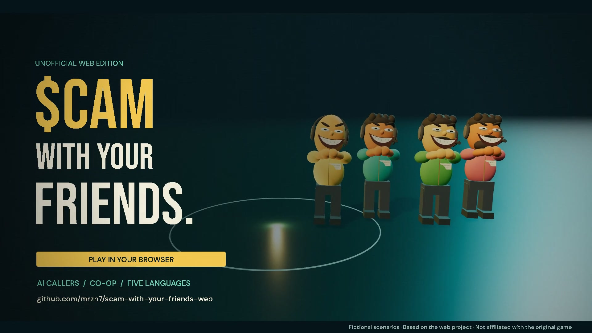

# Clock In, Cash Out

A 48-second cinematic trailer for **Scam With Your Friends — Web**. The original game name stays intact; the end card identifies this as an unofficial Web Edition.

[English film](../../docs/media/trailer-en.mp4) · [中文字幕版](../../docs/media/trailer-zh-CN.mp4) · [Original score](../../docs/media/trailer-score.mp3)



## Creative direction

A mundane first day becomes an absurd office caper. Warm gold, dark teal, expressive employee faces, large condensed type and an original electronic score carry the story. The telephone begins the rhythm; verification clicks rise in pitch; a cash chime punctuates the first payout; the quota montage adds a racing clock before the employee's exaggerated grin and final title.

This is **scripted promotional animation**, not an unedited gameplay recording. The office, staff rigs and caller portraits come from this web implementation. Cameras, studio shots, flying props, dialogue examples, interface staging and timing were arranged for the trailer. The countdown montage is accelerated. The trailer does not demonstrate live AI latency or prove multiplayer network performance.

## Shot list

| Time | Picture | Sound |
| --- | --- | --- |
| 00–04 | Telephone hero shot; your shift starts | Desk-phone ring, bass pickup, receiver click |
| 04–10 | Moving camera across the game office; red stamp | Main groove, transition, stamp thump |
| 10–16 | Three illustrated callers and absurd questions | Melodic hook, incoming-call ticks |
| 16–23 | Fictional three-field verification; +$400 | Rising confirmation notes, cash chime |
| 23–30 | Four staff characters; floating deliveries | Full rhythm section, stereo prop whooshes |
| 30–37 | Quota montage, flying papers, urgent clock | Sixteenth-note pulse, ticking, riser |
| 37–41 | Close-up of the employee's toothy grin | Comic musical break, second stamp |
| 41–48 | Original title, Web Edition, browser CTA | Logo impact, harmonic resolve, fade |

## Deliverables

The MP4s are web-optimized with H.264 bitrate capped at 5 Mbps and a front-loaded metadata atom for progressive playback. The full-quality picture intermediate remains in `.renders/silent.mp4`.

All final assets are in [`docs/media/`](../../docs/media/):

- `trailer-en.mp4`: 1920 × 1080, 30 fps, 48 seconds, H.264 with AAC stereo.
- `trailer-zh-CN.mp4`: same film with burned-in Simplified Chinese captions, placed outside the picture in a reserved bottom strip.
- `trailer-preview.gif`: five-second, 800-pixel-wide soundless README loop.
- `trailer-poster.jpg`: still image for links and video players.
- `trailer-score.mp3`: original music without the effects stem.
- `trailer.en.srt` and `trailer.zh-CN.srt`: editable caption files.

The film contains music and effects, **no spoken voiceover**. Caller mouth movements are staged animation. The mix is approximately −15 LUFS before encoding, with headroom retained in the delivered AAC. WAV stems and intermediate frames stay local in `.renders/` to avoid bloating the repository.

## Rebuild

Use Node.js 24+, the project's npm dependencies, installed Chrome, FFmpeg with `libx264`/`libass`, and Python with NumPy and SciPy. No AI, TTS, stock-media or account credentials are needed. This studio does not call the production backend and is not a playable guest demo.

```sh
npm ci
python -m pip install numpy scipy
npx vite --config marketing/trailer/vite.config.ts
```

Keep that terminal running. In another terminal, from the repository root:

```sh
node marketing/trailer/render.mjs         # inspect representative PNG frames first
python marketing/trailer/score.py        # original score, effects and mix WAVs
node marketing/trailer/render.mjs --full # sequential 1080p frame render
node marketing/trailer/package.mjs       # MP4s, captions, GIF, poster and MP3
```

`FFMPEG` can point to an installed executable if it is not on PATH. The renderer uses installed Chrome by default; set `CHROME_CHANNEL` for another supported Playwright channel. It intentionally enables software WebGL for reproducible headless rendering. Rendering speed depends heavily on the CPU. All frames are synthesized; the script does not record your desktop or access your signed-in browser.

Chinese captions use the installed Microsoft YaHei font on Windows, or Noto Sans CJK SC elsewhere. Set `CJK_FONT` if needed. **No Microsoft font files are included.** To preview the completed film locally, open `/marketing/trailer/watch.html` on the studio's Vite server.

## Delivery checks

Both MP4s were decoded end to end without errors. Chrome playback checks passed for 1920 × 1080 dimensions, exact 48-second duration, seeking, decoded frames, playback advancement and switching between the two language versions. Representative frames, title/character spacing and the Chinese caption area were inspected. The delivered mix measures **−15.5 LUFS integrated / −1.6 dBTP**; it contains no clipped PCM samples. Re-run the player checks with `node marketing/trailer/verify.mjs` while the studio server is running.

## Sources and notices

- `main.ts`: project-created camera animation, typography, telephone, props and compositing.
- `office.ts`: trailer snapshot adapted from this repository's `src/components/Office.tsx`.
- Staff and portraits: `src/components/avatar.ts` and `src/components/Portrait.tsx`, reused directly.
- `score.py`: original procedural composition, oscillator instruments, percussion and synthesized effects. No downloaded recordings, sampled songs or cloned voices.
- Bebas Neue, Barlow Condensed and DM Sans: unmodified Latin WOFF2 files obtained through Fontsource; SIL Open Font License texts are retained in `fonts/`. See [font provenance](fonts/README.md).

The project's [license and provenance notice](../../THIRD_PARTY_NOTICES.md) still applies. This trailer does not include downloaded original-game footage, original-game audio or music from a commercial recording. That does not grant rights to third-party game names, trademarks or protected visual expression.

The maintained demo is https://scam.gamefun.world (login required). The current film's end card links to this GitHub repository, whose README links directly to the demo.

## GitHub inline playback

The English and Chinese repository READMEs use GitHub-hosted video attachments as standalone URLs, which GitHub renders as players. These are full-length 720p editions with music and effects, approximately 6.9 MB each, below the free-plan 10 MB attachment limit. The original 1080p MP4 downloads remain in `docs/media/`. Attachment access follows the repository's visibility.

To regenerate a compact attachment edition, transcode the corresponding 1080p file with:

```sh
ffmpeg -i docs/media/trailer-en.mp4 -vf scale=1280:720 -c:v libx264 -preset medium -b:v 1100k -maxrate 1250k -bufsize 2500k -pix_fmt yuv420p -c:a aac -b:a 128k -movflags +faststart marketing/trailer/.renders/embed-en.mp4
```

Upload the resulting file through GitHub's attachment uploader, then place the returned attachment URL in its own paragraph in the README. Keep the existing attachment until its replacement upload succeeds.
